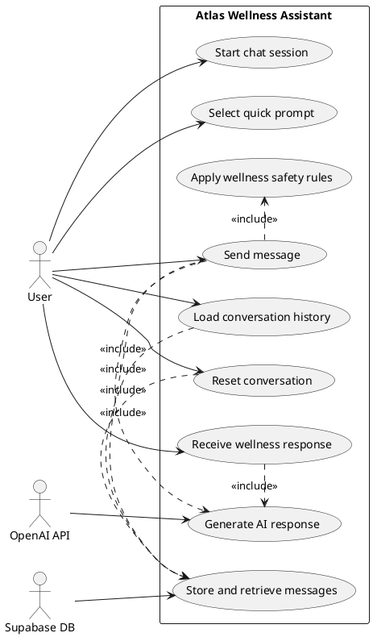
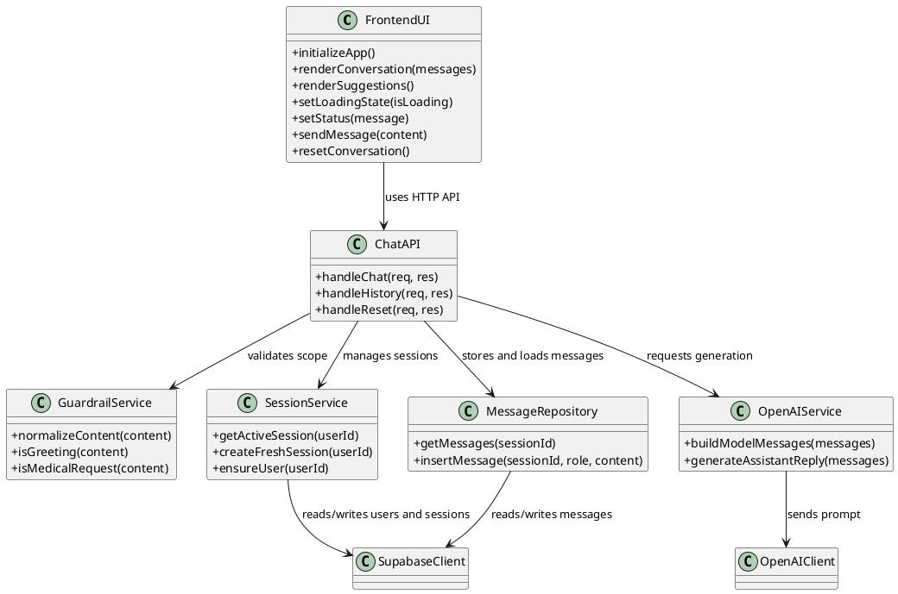
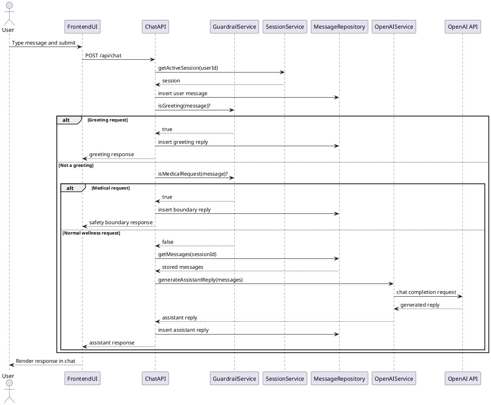
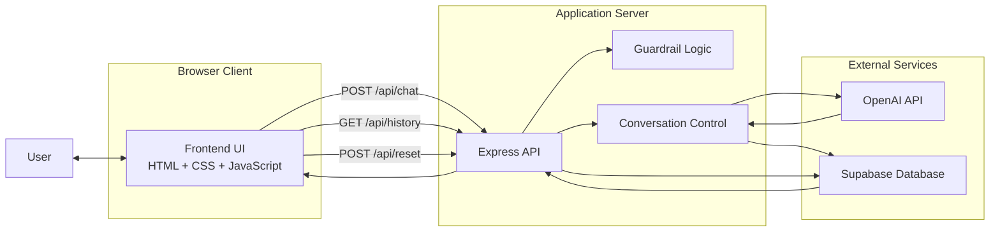
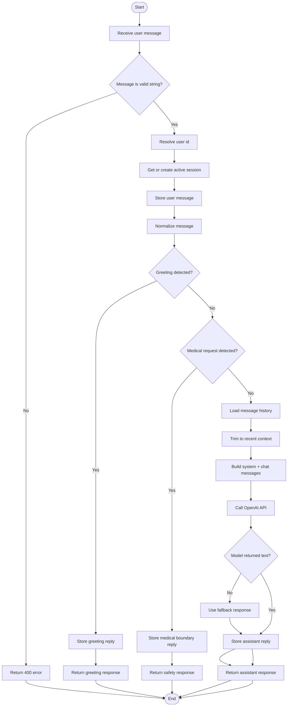

# CS4366 Senior Capstone Project
## Stage 2 - Software Design Specification (SDS)

### Cover Page

- Project Title: Atlas Wellness Assistant
- Project Number: [Add project number]
- Group Name: [Add group name]
- Course: CS4366 Senior Capstone Project
- Stage: Stage 2 - Software Design Specification
- Submission Date: [Add submission date]

### Team Members

- [Full Name 1]
- [Full Name 2]
- [Full Name 3]
- [Full Name 4]

### Instructor

- [Instructor Name]

---

## 0. Stage 2 Team Coordination

This section is included so the report matches the expectations shown in the assignment sheet and can also be reused in the updated group document or group webpage.

### 0.1 Group Members and Roles for This Stage

- Member 1: Project coordination, report integration, and final review
- Member 2: System analysis and UML diagrams
- Member 3: Architecture, algorithms, and flowcharts
- Member 4: Frontend and user interface documentation

Replace these role descriptions with your real team assignments before submission.

### 0.2 Group Meetings and Activities

- Meeting 1: Discussed project scope and revised the project description
- Meeting 2: Decomposed the system into modules and identified UML components
- Meeting 3: Prepared system architecture, flowchart, and implementation plan
- Meeting 4: Reviewed the report and aligned it with Stage 2 deliverables

Replace these meeting items with your actual dates and activities.

### 0.3 Upcoming Schedule

- Complete final editing of the report
- Export diagrams if required by the instructor
- Prepare the 10-minute presentation slides
- Rehearse the presentation as a group

---

## 1. Step 1 - Revised Project Description and Motivation

### 1.1 Revised Project Description

Atlas Wellness Assistant is a web-based chatbot system created to provide non-medical wellness guidance. The system is designed to help users with daily well-being topics such as sleep, stress management, energy improvement, focus, motivation, routines, hydration, movement, and recovery. The chatbot does not diagnose diseases, interpret symptoms, or recommend medical treatments. Its purpose is to stay inside a safe wellness scope while still giving useful and conversational support.

The current version of the project includes:

- A frontend built with HTML, CSS, and vanilla JavaScript
- A backend built with Node.js and Express
- OpenAI API integration for AI-generated responses
- Supabase for persistent storage of users, sessions, and messages

The system currently supports:

- Starting a chat conversation from the browser
- Sending wellness-related questions
- Receiving AI-generated wellness responses in English
- Restoring prior conversation history for the same browser user
- Resetting the conversation
- Using quick prompt suggestions in the UI

### 1.2 Motivation

The motivation behind this project is to explore how conversational AI can support users in everyday wellness situations without crossing into medical advice. Many people want practical suggestions for sleep, stress, energy, and healthy habits, but they do not necessarily need a diagnostic or clinical chatbot.

This project is a good capstone topic because it combines:

- Full-stack software development
- AI service integration
- Cloud-based persistence
- System decomposition and design
- Interface design
- Safety constraints and bounded system behavior

In other words, the project is not only about building a chatbot, but also about designing a complete software system with clear boundaries and modular structure.

### 1.3 Problem Statement

General-purpose chatbots may produce inconsistent or unsafe answers when users ask health-related questions. The problem addressed by this project is how to build a chatbot that remains helpful, conversational, and practical while staying restricted to a non-medical wellness domain.

### 1.4 Objectives

The objectives of this project are:

- To create a web-based chatbot for wellness support
- To keep the system limited to safe, non-medical interactions
- To maintain user conversation history using persistent sessions
- To design a modern and usable interface
- To demonstrate system analysis, architecture design, UML modeling, and implementation planning

### 1.5 Scope and Boundaries

In scope:

- Wellness conversations
- Habit improvement suggestions
- Chat interface and conversation history
- OpenAI integration
- Supabase persistence
- Basic safety guardrails

Out of scope:

- Diagnosis
- Medical treatment
- Prescriptions
- Symptom triage
- Emergency guidance
- Full authentication and user accounts

---

## 2. Step 2 - System Analysis and Decomposition

### 2.1 System Overview

The Atlas system can be understood as a layered client-server application. A user interacts with the frontend in the browser. The frontend sends requests to the backend API. The backend validates the request, applies safety rules, retrieves or stores session data in Supabase, and then calls the OpenAI API to generate a response when appropriate.

### 2.2 Main Modules or Subsystems

The system is decomposed into the following modules:

1. User Interface Module
   This module is responsible for rendering the chat page, receiving user input, showing assistant replies, restoring history, and handling interface actions such as reset and quick prompts.

2. API Module
   This module exposes the routes `/api/chat`, `/api/history`, and `/api/reset`. It acts as the communication bridge between the browser and the backend logic.

3. Conversation Control Module
   This module validates messages, applies wellness-only rules, detects greetings, detects medical-request patterns, trims message history, and prepares the final prompt for the AI service.

4. Persistence Module
   This module manages user, session, and message records in Supabase.

5. AI Response Module
   This module sends structured prompts to OpenAI and receives the generated response.

### 2.3 Functional Requirements

The system shall:

- Accept a user message from the web interface
- Send the message to the backend
- Create or reuse a user session
- Save the user message
- Detect greeting messages
- Detect medical diagnosis or treatment requests
- Generate wellness responses using OpenAI
- Save assistant responses
- Restore chat history
- Reset the current session when requested

### 2.4 Non-Functional Requirements

The system should:

- Be easy to use in a browser
- Produce responses within interactive response time
- Remain visually clear and modern
- Keep the chatbot inside a safe wellness-only boundary
- Be maintainable and modular
- Preserve message history reliably

---

## 3. Step 3 - UML Diagrams and Their Explanations

The assignment requires class, use case, and sequence diagrams. Since the current implementation uses functional JavaScript instead of formal object-oriented classes, the class diagram is presented as a conceptual component diagram using class notation. This is acceptable in software design because the goal is to understand the structure of the system and the responsibilities of its main parts.

### 3.1 Use Case Diagram

The use case diagram shows the external view of the system. It answers the question: what can the user do with the system?

Main use cases:

- Start chat session
- Send message
- Receive wellness response
- Load conversation history
- Reset conversation
- Select quick prompt

External supporting systems:

- OpenAI API
- Supabase database

#### Explanation

This diagram is useful because it defines the system boundary clearly. The main actor is the user, while OpenAI and Supabase are external systems that help the application deliver its services. The diagram also makes clear that the chatbot is not just a text generator. It also supports storage, retrieval, and session management.

### 3.2 Class Diagram

The class diagram models the major software components and their responsibilities:

- `FrontendUI`
- `ChatAPI`
- `GuardrailService`
- `SessionService`
- `MessageRepository`
- `OpenAIService`
- `SupabaseClient`
- `OpenAIClient`

#### Explanation

This diagram helps explain how responsibilities are distributed:

- `FrontendUI` handles user interaction
- `ChatAPI` manages HTTP requests and responses
- `GuardrailService` applies scope restrictions
- `SessionService` handles user and session logic
- `MessageRepository` handles storage and retrieval of messages
- `OpenAIService` generates replies using the external AI model

Even though the source code is mostly functional, this diagram represents the conceptual design of the software architecture and is useful for system understanding.

### 3.3 Sequence Diagram

The sequence diagram shows the order of interactions during a normal chat request. It begins when the user sends a message in the browser and ends when the assistant response is rendered on screen.

#### Explanation

This diagram helps explain the dynamic behavior of the system:

1. The user sends a message
2. The frontend calls the backend
3. The backend gets or creates the current session
4. The backend stores the user message
5. The guardrail logic determines whether the request is a greeting, a medical request, or a normal wellness request
6. If it is a normal wellness request, the backend retrieves recent messages and calls the OpenAI API
7. The assistant reply is stored and returned to the frontend
8. The frontend renders the reply

This is important because it shows that the project is a coordinated system with multiple modules working together, not just a single AI prompt.

---

## 4. Step 4 - Initial User Interface Design

The assignment also asks for an initial version of the user interface and screenshots with functionalities. The current implementation of Atlas already provides a working initial UI prototype. It includes a modern split-layout design with:

- A branding and overview panel
- A live chat panel
- Quick prompt buttons
- A message input area
- A reset button
- A status message area

### 4.1 Interface Goals

The interface was designed with the following goals:

- Keep the chat experience simple
- Make the system feel modern and professional
- Let users see suggested prompt ideas
- Keep the input area visible and easy to use
- Present the chatbot as a wellness assistant rather than a medical system

### 4.2 Main Interface Functionalities

The current UI supports:

- Sending a message
- Receiving a response
- Viewing restored conversation history
- Using quick prompts
- Resetting the conversation
- Reading safety and status messages

### 4.3 Screenshot Section for Final Submission

Because this report is being prepared as a single Markdown file, the screenshots are described below and should be inserted into the Word or PDF version of the final submission.

Figure 1. Main chat interface before interaction

- Show the split-screen layout
- Show the hero panel on the left
- Show the empty or initial chat area on the right

Figure 2. Chat conversation after user input

- Show one user message
- Show one assistant response
- Show the active chat flow

Figure 3. Quick prompts and status behavior

- Show quick prompt buttons
- Show status text or loading message

Figure 4. Reset or restored history behavior

- Show either restored conversation history or the reset state after pressing the reset button

### 4.4 Short UI Explanation

The user interface reflects the system purpose. The left panel communicates the wellness theme and sets the tone for the application. The right panel contains the interactive chat features and groups them into a natural conversation flow. This design supports clarity and ease of use, which are important grading criteria for a project report and presentation.

---

## 5. Step 5 - Potential Solutions

### 5.1 Solution Option 1: Rule-Based Chatbot

Description:

- The chatbot uses fixed rules and keywords to determine a response.

Advantages:

- Easy to implement
- Predictable behavior
- No external AI dependency

Disadvantages:

- Limited flexibility
- Poor conversational quality
- Hard to scale to different wellness topics

Conclusion:

- This option is too limited for a modern wellness assistant

### 5.2 Solution Option 2: FAQ or Retrieval-Based Chatbot

Description:

- The chatbot retrieves answers from a predefined knowledge base.

Advantages:

- More controlled than a generative chatbot
- Better consistency for standard questions
- Easier to validate answers

Disadvantages:

- Limited personalization
- Weak conversational continuity
- Requires a curated database of answers

Conclusion:

- Better than pure rules, but still not ideal for natural conversation

### 5.3 Solution Option 3: LLM-Based Chatbot with Guardrails

Description:

- The chatbot uses a large language model for response generation, while safety and scope are enforced through backend rules and system prompts.

Advantages:

- Natural and flexible conversation
- Better user experience
- More adaptable to different wellness topics
- Easy to extend later

Disadvantages:

- Requires prompt engineering
- Depends on external API availability
- Requires careful safety restrictions

Conclusion:

- This is the best solution for this project and was selected for implementation

---

## 6. Step 6 - Selected System Architecture, Algorithms, and Flowcharts

### 6.1 Selected System Architecture

The final architecture is a client-server architecture with cloud persistence and AI integration.

Main parts:

- Browser frontend
- Express backend
- Guardrail logic
- OpenAI API
- Supabase database

### 6.2 Architecture Explanation

The frontend handles interaction and displays messages. The backend controls the business logic. Supabase stores sessions and messages. OpenAI is used only after the backend confirms that the request belongs to the safe wellness scope. This structure makes the system modular and easier to explain and maintain.

### 6.3 Main Algorithm

The main response-generation algorithm works as follows:

1. Receive a message from the frontend
2. Validate the message format
3. Resolve the user identity
4. Get or create a session
5. Store the user message
6. Normalize and analyze the message
7. If the message is a greeting, return a greeting response
8. If the message asks for diagnosis or treatment, return a safety boundary response
9. Otherwise retrieve message history
10. Trim the conversation context
11. Build the model prompt
12. Send the prompt to OpenAI
13. Receive the assistant reply
14. Store the reply
15. Return the response to the frontend

### 6.4 Pseudocode

```text
function processChat(message, userId):
    validate message
    resolvedUserId = resolveUserId(userId)
    session = getActiveSession(resolvedUserId)
    storeMessage(session, "user", message)

    if isGreeting(message):
        reply = greetingMessage
        storeMessage(session, "assistant", reply)
        return reply

    if isMedicalRequest(message):
        reply = medicalBoundaryMessage
        storeMessage(session, "assistant", reply)
        return reply

    history = getMessages(session)
    context = trimToRecentMessages(history)
    reply = generateWithOpenAI(context)
    storeMessage(session, "assistant", reply)
    return reply
```

### 6.5 Flowchart Explanation

The flowchart is important because it makes the decision path of the system easy to understand. It shows:

- validation
- greeting detection
- medical-request detection
- history retrieval
- AI generation
- response storage

This directly supports the SDS requirement for algorithms and their flowcharts.

---

## 7. Step 7 - Implementation Plan

### 7.1 Testbed

The project testbed is a local web application environment:

- Windows PC or laptop
- Browser-based UI
- Local Node.js runtime
- Internet access for OpenAI and Supabase

### 7.2 Programming Languages

- JavaScript
- HTML
- CSS
- SQL

### 7.3 Development Tools and Devices

- Visual Studio Code
- Git and GitHub
- PowerShell terminal
- Browser developer tools
- OpenAI JavaScript SDK
- Supabase JavaScript SDK
- PlantUML for UML diagrams
- Mermaid for architecture and flowcharts

### 7.4 Step-by-Step Development Plan

Phase 1: Define the project scope

- Choose the wellness-only chatbot direction
- Define safe and unsafe system boundaries

Phase 2: Build the frontend

- Create the chat page
- Add the message input
- Add quick prompt buttons
- Add reset and status features

Phase 3: Build the backend

- Create API endpoints
- Add request validation
- Add guardrail logic
- Add OpenAI integration

Phase 4: Add persistence

- Create Supabase tables
- Store users, sessions, and messages
- Load prior history

Phase 5: Test and improve

- Test normal wellness requests
- Test greeting behavior
- Test medical-boundary behavior
- Test history loading and reset
- Improve frontend design

Phase 6: Prepare submission materials

- Write the report
- Finalize UML diagrams
- Prepare screenshots
- Create presentation slides

### 7.5 Testing Strategy

Functional tests:

- Send a normal wellness question
- Send a greeting
- Send a medical-style question
- Refresh the page and verify history restoration
- Reset the chat and verify a new session starts

Integration tests:

- Check frontend to backend communication
- Check backend to OpenAI communication
- Check backend to Supabase communication

Usability tests:

- Check desktop layout
- Check mobile layout
- Check readability and clarity of controls

---

## 8. Step 8 - Risks, Limitations, and Future Work

### 8.1 Risks

Risk 1: Unsafe or off-topic model output

Mitigation:

- Use a constrained system prompt
- Apply guardrails before generation

Risk 2: API or network failure

Mitigation:

- Show error feedback to the user
- Keep the frontend stable

Risk 3: Database misconfiguration or storage issues

Mitigation:

- Validate environment variables
- Handle backend errors explicitly

### 8.2 Current Limitations

- No authentication
- No advanced intent classifier
- No crisis escalation flow
- No analytics dashboard
- No automated unit test suite yet

### 8.3 Future Work

- Add authentication and user profiles
- Add daily check-ins and wellness scoring
- Add stronger safety handling for urgent cases
- Add analytics and monitoring
- Add automated testing

---

## 9. Step 9 - Conclusion

Atlas Wellness Assistant is a strong Stage 2 capstone project because it demonstrates complete software design thinking. It includes system decomposition, UML-based modeling, architecture design, AI integration, persistence, interface design, and implementation planning. The project is focused enough to be safe and manageable, but complex enough to demonstrate real software engineering skills.

---

## Appendix A - Use Case Diagram



## Appendix B - Class Diagram



## Appendix C - Sequence Diagram



## Appendix D - System Architecture



## Appendix E - Response Flowchart


