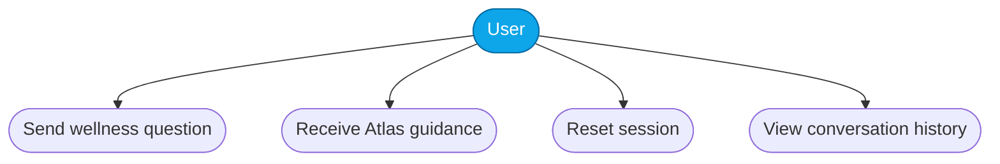
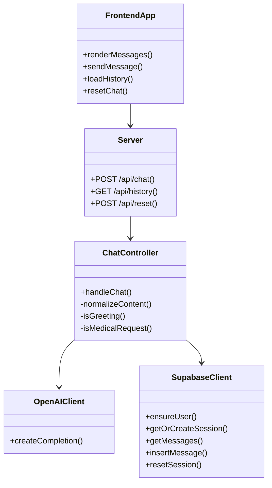
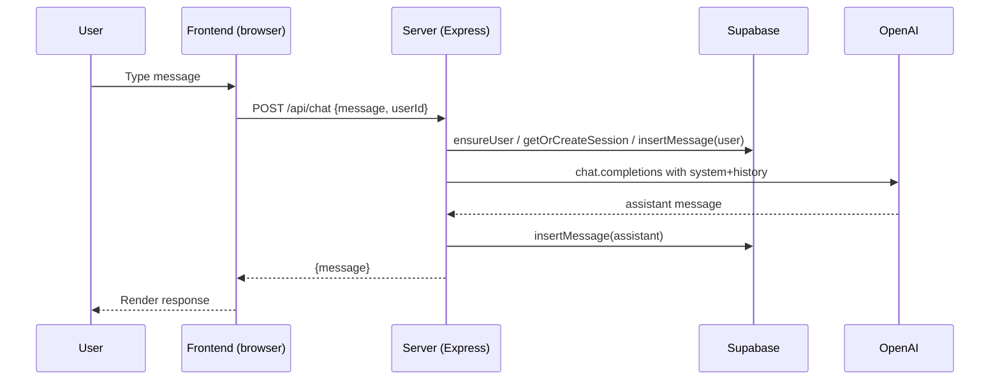
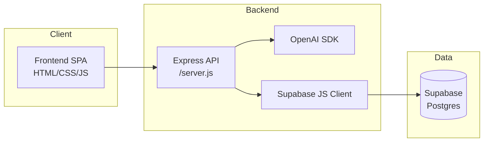
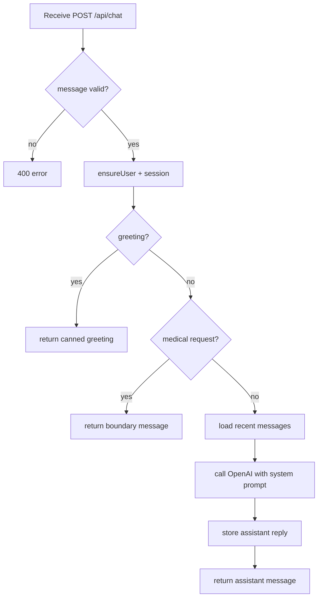

# Atlas Wellness Assistant

A lightweight Node + Express + OpenAI web app. Atlas is a wellness-only assistant for everyday habits, sleep, stress, energy, focus, and routines. It does not provide medical diagnoses or treatments.

## Setup

1. Copy `.env.example` to `.env` (create if missing):
   - `OPENAI_API_KEY=your-openai-key`
   - `OPENAI_MODEL=gpt-4` (optional)
   - `PORT=3000` (optional)
   - `SUPABASE_URL=your-supabase-url`
   - `SUPABASE_KEY=your-supabase-key`

2. Install deps:
   - `npm install`

3. Run:
   - `npm start`

4. Open http://localhost:3000

## API
- `POST /api/chat` with `{ message: string, userId?: string }`.
- `GET /api/history?userId=...`.
- `POST /api/reset` with `{ userId?: string }`.

## Current behavior
- Atlas responds as a wellness assistant only.
- Responses are delivered in English even if the user types in another language.
- Medical diagnosis and treatment requests are redirected to licensed healthcare professionals.
- Messages are stored in Supabase per browser user id, and the frontend restores recent conversation history.

## Next steps
1. Add user auth with Sign in / Sign up.
2. Add explicit crisis and urgent-symptom safety flows.
3. Add analytics and monitoring in production.
4. Add configurable prompt chips and personalized wellness plans.

## System analysis and decomposition
### Use case diagram

### Class diagram (logical)

### Sequence diagram (chat flow)

## Architecture and algorithms
### System architecture

### Chat handling flow (algorithm)

## Implementation plan
- **Programming language/runtime**: Node.js 18+, frontend vanilla JS/CSS/HTML.
- **APIs/SDKs**: OpenAI `chat.completions`; Supabase JS client for Postgres persistence.
- **Tools**: npm scripts (`npm start`), node CLI for quick prompts (`npm run cli`), mermaid-ready Markdown for diagrams.
- **Testbed**: local machine with `.env` configured; Supabase project with schema from `supabase/init.sql`; optional mock OpenAI key for dry runs.
- **Verification steps**: start server, send sample chat and reset, confirm history restore; ensure medical requests return boundary message; confirm responses stay in English.
